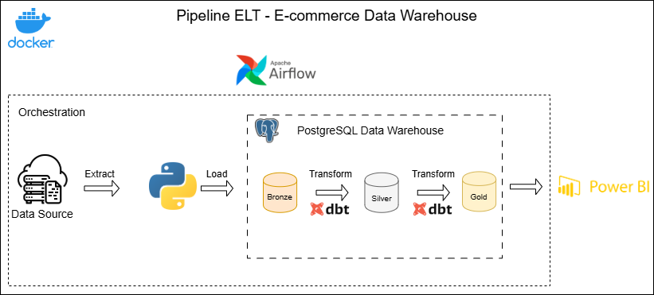

# ELT Data Warehouse Pipeline - Olist Brazilian E-Commerce

## Sobre o projeto

Este projeto tem como objetivo construir uma pipeline de dados end-to-end utilizando o dataset público **Brazilian E-Commerce Public Dataset by Olist**, simulando um cenário real de Engenharia de Dados.

A solução contempla desde a ingestão dos dados brutos até a disponibilização de modelos analíticos preparados para consumo em ferramentas de Business Intelligence.

O projeto foi desenvolvido com foco em aplicar conceitos utilizados no mercado, como:

- Processos de ETL/ELT;
- Arquitetura em camadas;
- Modelagem dimensional;
- Transformações utilizando SQL e dbt;
- Qualidade e documentação dos dados;
- Automação de pipelines.

## Arquitetura

A arquitetura do projeto segue uma abordagem inspirada no modelo Medallion Architecture, separando o fluxo de dados em camadas de ingestão, transformação e consumo analítico.

A primeira versão do projeto contempla a ingestão utilizando Python, armazenamento em PostgreSQL e transformação utilizando dbt.

A arquitetura abaixo representa a evolução planejada da solução, incluindo componentes futuros como orquestração com Apache Airflow e containerização utilizando Docker.

## Tecnologias utilizadas

#### Linguagens
- Python
- SQL

#### Banco de dados

- PostgreSQL

#### Engenharia de Dados

- dbt
- SQLAlchemy
- Pandas

#### Ingestão

- KaggleHub

#### Visualização

- Power BI

#### Controle de versão

- Git
- GitHub

## Fluxo de dados

O pipeline possui as seguintes etapas:

#### 1. Extração

Os arquivos CSV do dataset Olist são obtidos utilizando o KaggleHub.

Os dados originais são mantidos sem alterações para preservar a rastreabilidade da ingestão.

---

#### 2. Ingestão

Um processo desenvolvido em Python realiza:

- Leitura dos arquivos CSV;
- Validação inicial dos dados;
- Criação das tabelas no PostgreSQL;
- Carga dos dados brutos;
- Inclusão de metadados de ingestão.

Metadados adicionados:

- Data/hora da ingestão;
- Arquivo de origem;
- Caminho do arquivo.

---

### 3. Transformação

As transformações são realizadas utilizando dbt.

O dbt é responsável por:

- Organização dos modelos SQL;
- Padronização dos dados;
- Aplicação de regras de negócio;
- Testes de qualidade;
- Documentação dos modelos.

---

### 4. Consumo analítico

Os dados tratados na camada Gold são disponibilizados para análises de negócio através de dashboards no Power BI.

---

## Estrutura do projeto
    E-Commerce-Data-Ingestion/
 
    ├──  src/  
    │    └── data_load.py  
    │  
    ├── dbt/  
    │ ├── models/  
    │ │ ├── staging/   
    │ │ ├── intermediate/  
    │ │ └── marts/  
    │ ├── tests/  
    │ └── dbt_project.yml  
    │  
    ├── dashboards/  
    │  
    ├── docs/  
    │  
    ├── .env.example  
    ├── .gitignore  
    ├── README.md  
    └── requirements.txt
---

## Camadas de dados

#### Bronze

Responsável pelo armazenamento dos dados brutos.

Características:

- Preserva os dados originais;
- Mantém histórico da ingestão;
- Possui metadados de origem.

Exemplo:
- bronze.olist_customers
- bronze.olist_orders
- bronze.olist_sellers

---

#### Silver

Camada responsável pela preparação dos dados.

Processos realizados:

- Padronização de nomes;
- Tratamento de tipos;
- Remoção de inconsistências;
- Tratamento de valores nulos;
- Enriquecimento dos dados;
- Aplicação de regras de qualidade.

Implementação:

dbt models - staging/intermediate

---

#### Gold

Camada orientada ao consumo analítico.

Objetivo:

- Disponibilizar dados confiáveis para análise;
- Facilitar criação de indicadores;
- Reduzir complexidade para usuários finais.

Esta camada ainda está em implementação
## Como executar

### Pré-requisitos

Antes de executar o projeto, é necessário possuir instalado:

- Python 3.13.9
- PostgreSQL
- dbt-postgres
- Git

---
#### Clonar o repositório

Clone o projeto e acesse o diretório:

git clone https://github.com/rafaelseigiura/E-Commerce-Data-Ingestion.git

cd E-Commerce-Data-Ingestion
Criar ambiente virtual Python

#### Configurar o ambiente Python

Crie um ambiente virtual para isolar as dependências do projeto.

##### Windows:

python -m venv venv
venv\Scripts\activate

##### Linux / macOS:

python -m venv venv
source venv/bin/activate

#### Instale as dependências do projeto:

pip install -r requirements.txt

#### Configurar as variáveis de ambiente

Crie um arquivo .env na raiz do projeto utilizando como base o arquivo .env.example e configure as credenciais de acesso ao PostgreSQL.

Exemplo:

DB_HOST=localhost
DB_PORT=5432
DB_NAME=olist
DB_USER=postgres
DB_PASSWORD=sua_senha
Executar a ingestão dos dados

A etapa de ingestão é responsável por obter o dataset Brazilian E-Commerce Public Dataset by Olist, realizar a leitura dos arquivos CSV, criar as tabelas da camada Bronze no PostgreSQL, carregar os dados brutos e adicionar os metadados necessários para garantir a rastreabilidade da ingestão.

#### Execute o pipeline de ingestão:

python src/data_load.py

Ao final dessa etapa, os dados estarão disponíveis na camada Bronze.

#### Executar as transformações com dbt

Acesse o diretório do projeto dbt:

cd dbt

Instale as dependências do projeto:

dbt deps

Execute todos os modelos:

dbt run

Execute os testes de qualidade dos dados:

dbt test

Ao final da execução, os dados estarão disponíveis nas camadas Silver e Gold.

#### Fluxo de execução

Após a configuração do ambiente, o pipeline é executado na seguinte sequência:

Configuração do ambiente
        ↓
Ingestão dos dados (Python)
        ↓
PostgreSQL - Bronze
        ↓
Transformações com dbt
        ↓
Camada Silver
        ↓
Camada Gold
        ↓
Power BI

## Próximos passos

Evoluções planejadas para aproximar a solução de um ambiente produtivo:

#### Orquestração

Implementação de Apache Airflow para gerenciamento e agendamento dos pipelines.

Objetivos:

- Automatizar execução da ingestão;
- Controlar dependências entre tarefas;
- Criar monitoramento das execuções.

---

### Containerização

Utilização de Docker para padronizar o ambiente de execução.

Objetivos:

- Facilitar configuração do projeto;
- Reproduzir o ambiente em diferentes máquinas;
- Preparar a aplicação para deploy.

---

### CI/CD

Implementação de pipelines automatizados para:

- Validação dos modelos dbt;
- Execução de testes;
- Controle de qualidade antes do deploy.